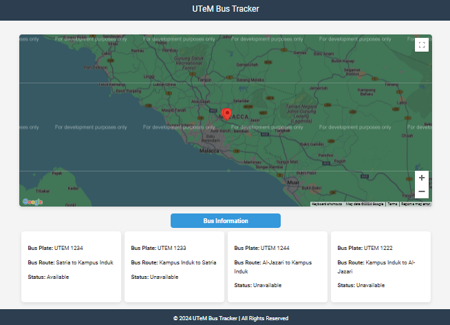
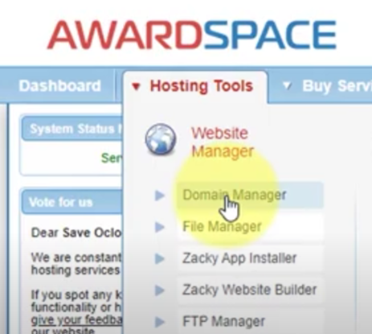
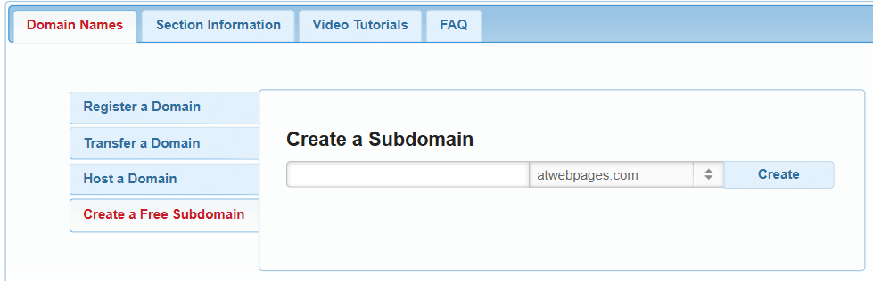

# UTeM Bus Tracking System

This project is developed from the previous version, V1.0 from the Esp32 webserver to create a domain for the http website in this version. It is created to participate in the UTeM Smart Campus Challenge with the collaboration with two friend from other course. Thanks for the effort from two team members, the project managed to get the Third price award and Best Design Award.

<div align="center">
   
</div>

## Table of Contents
1. [Download](#Download)
2. [Web Setup](#Web_Setup)
3. [Features](#features)
4. [Documentation](#documentation)
5. [Contributing](#contributing)
6. [License](#license)
7. [Acknowledgments](#acknowledgments)
8. [Website Address](#Website_address)

## Download

### Step (using git clone)
1. Clone the repository:
   ```bash
   git clone https://github.com/username/project-name.git

## Web_Setup

### Step 1: Create SubDomain
1. Account registration for AwardSpace free web hosting:
[Link text](https://www.awardspace.com/)


2. After done login, go to the "Hosting Tools"(beside Dashboard)
<div align="center">
   
</div>

3. Go to create a subdomain
<div align="center">
   
</div>


### Step 2: Create database
1. Acco
